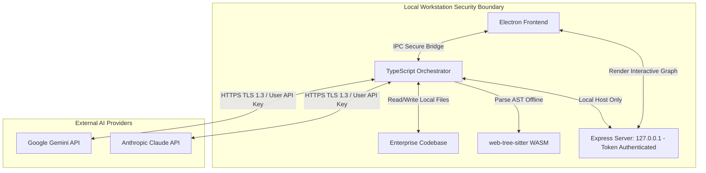

# Understand Anything Desktop — Enterprise Guide (Security, Compliance & Architecture)

This document provides detailed information about the architecture, security posture, and data flow of **Understand Anything Desktop** for enterprise compliance, IT departments, and security teams.

---

## 1. English — Enterprise Security & Compliance Guide

### Overview
**Understand Anything Desktop** is a local-first desktop application designed to generate and explore interactive knowledge graphs of any codebase. It runs on Electron (HTML/CSS/JS) with a Node.js/TypeScript orchestrator.

### Core Architecture & Privacy
1. **Local-First Processing:** Code scanning, Abstract Syntax Tree (AST) parsing (via WASM-based `web-tree-sitter`), graph building, and visual rendering are executed **100% locally** on the user's workstation. 
2. **Zero Telemetry:** The application does not collect, store, or transmit any analytical data, usage metrics, telemetry, or system information to external cloud servers.
3. **No Intermediate Backends:** There are no server intermediaries. The application does not connect to any proprietary cloud services hosted by the developers.

### External AI Connections & Data In/Out
When the AI-assisted analysis phase is enabled:
* **Data Outbound:** Portions of the local codebase (organized in source code batches) are sent directly to the LLM API provider chosen by the user:
  * **Google Gemini API:** Sent directly to `https://generativelanguage.googleapis.com`
  * **Anthropic Claude API:** Sent directly to `https://api.anthropic.com`
* **Data Inbound:** The application receives semantic descriptions, file summaries, and dependency structures back from the API to enrich the local graph.
* **Credentials:** API keys are provided locally by the user, stored in the local application configuration, and sent via encrypted HTTPS (TLS 1.3) headers directly to the API endpoints.

### Local Embedded Services
* **Express Server:** During execution, a local Express HTTP server is spawned on a random port. 
  * **Security Control:** It listens **strictly on loopback interfaces** (`127.0.0.1` / `localhost`). It is not accessible from the local network.
  * **Authentication:** Access is protected by a single-use authorization token randomly generated in memory at boot.
* **Git Operations:** The app executes local `git` commands (e.g., to list modified files). It does so using secure parameter passing (`execFile`) to prevent shell command injection.

---

## 2. Português — Guia de Segurança e Conformidade Corporativa

### Visão Geral
O **Understand Anything Desktop** é um aplicativo desktop local-first projetado para gerar e explorar grafos de conhecimento interativos a partir de qualquer base de código. Ele é executado em Electron (HTML/CSS/JS) com um orquestrador em Node.js/TypeScript.

### Arquitetura e Privacidade de Dados
1. **Processamento Local:** A varredura de arquivos, o parsing de árvore de sintaxe abstrata (AST) via `web-tree-sitter` (WASM), o agrupamento de módulos e a renderização do grafo ocorrem **100% localmente** na estação de trabalho do usuário.
2. **Zero Telemetria:** O aplicativo não coleta, armazena ou transmite nenhuma métrica de uso, telemetria ou informações do sistema para servidores externos.
3. **Sem Servidores Intermediários:** Não existem intermediários de nuvem proprietários. O aplicativo não se conecta a servidores de controle ou hospedagem dos desenvolvedores da ferramenta.

### Comunicação com APIs de IA Externas
Caso a análise assistida por Inteligência Artificial seja ativada pelo usuário:
* **Envio de Dados:** Lotes de código-fonte local são enviados diretamente aos servidores oficiais do provedor de IA configurado:
  * **Google Gemini API:** Conecta-se diretamente a `https://generativelanguage.googleapis.com`
  * **Anthropic Claude API:** Conecta-se diretamente a `https://api.anthropic.com`
* **Recebimento de Dados:** O orquestrador recebe resumos semânticos e relações de dependência que retornam da API e os armazena localmente na pasta `.understand-anything/` do projeto escaneado.
* **Credenciais de Acesso:** As chaves de API fornecidas pelo usuário são passadas diretamente nos cabeçalhos HTTP através de conexões HTTPS criptografadas (TLS 1.3).

### Serviços Embarcados Locais
* **Servidor Web Express:** O aplicativo inicia um servidor Express em uma porta dinâmica durante a execução.
  * **Segurança:** O servidor escuta **estritamente na interface de loopback** (`127.0.0.1` / `localhost`), ficando inacessível para outros dispositivos na rede local.
  * **Autenticação:** As rotas são protegidas por um token de uso único gerado aleatoriamente na inicialização do aplicativo.
* **Subprocessos:** Executa comandos locais de `git` de forma segura (utilizando `execFile` e passagem estruturada de argumentos) para isolar modificações e evitar injeção de comandos.

---

## 3. Español — Guía de Seguridad y Conformidad Corporativa

### Resumen
**Understand Anything Desktop** es una aplicación de escritorio local-first diseñada para generar y explorar grafos de conocimiento interactivos a partir de cualquier código fuente. Se ejecuta en Electron (HTML/CSS/JS) con un orquestador Node.js/TypeScript.

### Arquitectura y Privacidad
1. **Procesamiento Local:** El escaneo de archivos, el análisis de árboles de sintaxis abstracta (AST) a través de `web-tree-sitter` (WASM), la construcción del grafo y la renderización del gráfico se realizan **100% localmente** en la estación de trabajo del usuario.
2. **Sin Telemetría:** La aplicación no recopila, almacena ni transmite métricas de uso, telemetría o información del sistema a servidores en la nube externos.
3. **Sin Servidores Intermediarios:** No hay intermediarios. La aplicación no se conecta a ningún servicio en la nube propiedad de los desarrolladores.

### Flujo de Datos con APIs de IA Externas
Cuando se activa la fase de análisis asistido por IA:
* **Salida de Datos:** Segmentos de código fuente local se envían directamente al proveedor de API de LLM configurado por el usuario:
  * **Google Gemini API:** Conexión directa a `https://generativelanguage.googleapis.com`
  * **Anthropic Claude API:** Conexión directa a `https://api.anthropic.com`
* **Entrada de Datos:** La aplicación recibe descripciones semánticas y resúmenes de código de vuelta de la API para enriquecer el grafo local.
* **Credenciales:** Las claves de API se configuran de forma local por el usuario y se transmiten mediante HTTPS cifrado (TLS 1.3) directamente a los endpoints oficiales.

### Servicios Locales Integrados
* **Servidor Express:** Se levanta un servidor HTTP Express en un puerto aleatorio.
  * **Seguridad:** Escucha **estrictamente en la interfaz de bucle de retorno** (`127.0.0.1` / `localhost`). No está expuesto a la red local.
  * **Autenticación:** El acceso está protegido por un token de autorización temporal generado de forma aleatoria en memoria al arrancar.
* **Comandos de Git:** Ejecuta el comando nativo `git` en la máquina local para listar diferencias de código, utilizando APIs seguras de paso de argumentos (`execFile`).

---

## 4. 日本語 — エンタープライズ向けセキュリティ＆コンプライアンスガイド

### 概要
**Understand Anything Desktop** は、あらゆるコードベースからインタラクティブな知識グラフ（ナレッジグラフ）を生成および可視化するためのローカルファーストのデスクトップアプリケーションです。Electron (HTML/CSS/JS) と Node.js/TypeScript のオーケストレーター上で動作します。

### 基本アーキテクチャとプライバシー
1. **完全ローカル処理:** コードのスキャン、`web-tree-sitter` (WASM) による抽象構文木 (AST) の解析、グラフの構築、グラフのレンダリングは、**100% ユーザーのローカルワークステーション上**で実行されます。
2. **テレメトリの排除:** アプリケーションは、利用者のシステム情報、メトリクス、分析データなどの情報を外部クラウドサーバーに収集・送信・保存することは一切ありません。
3. **中間サーバーの不在:** 開発元がホストする中間サーバーや中継用バックエンドは存在しません。アプリケーションは開発元の専用クラウドには接続しません。

### 外部 AI 接続およびデータフロー
AI アシストによるコード解析機能が有効化された場合：
* **外部送信データ:** ローカルコードベースの一部（バッチ処理されたソースコード）が、ユーザーが選択・設定した LLM API プロバイダーに直接送信されます：
  * **Google Gemini API:** `https://generativelanguage.googleapis.com` に直接送信。
  * **Anthropic Claude API:** `https://api.anthropic.com` に直接送信。
* **受信データ:** 送信したソースコード of セマンティクス説明や要約情報が、グラフ構築のためにローカルに戻り、保存されます。
* **認証情報:** API キーはユーザーによってローカルで管理・入力され、HTTPS (TLS 1.3) 暗号化接続を介して直接 API エンドポイントに送られます。

### ローカル組み込みサービス
* **ローカル Express サーバー:** 起動時、ランダムなポートで Express HTTP サーバーが立ち上がります。
  * **セキュリティ保護:** このサーバーは**ループバックアドレス** (`127.0.0.1` / `localhost`) のみをリッスンします。ローカルネットワーク上の他のマシンから接続することはできません。
  * **認証方式:** 起動時にメモリ内でランダムに生成されるワンタイム認証トークンによってアクセスが保護されます。
* **Git サブプロセス:** 差分スキャンのためにローカルの `git` コマンドを実行します。この際、シェルインジェクションを防ぐため、安全な `execFile` API が使用されます。

---

## 5. 简体中文 — 企业级安全与合规指南

### 概述
**Understand Anything Desktop** 是一款本地优先（Local-First）的桌面应用程序，旨在通过任何本地代码库生成并探索交互式知识图谱。它基于 Electron (HTML/CSS/JS) 运行，并通过 Node.js/TypeScript 任务调度器进行核心流程管理。

### 核心架构与数据隐私
1. **本地运行:** 代码扫描、抽象语法树 (AST) 解析（通过基于 WASM 的 `web-tree-sitter` 进行）、图谱构建以及图谱渲染 **100% 在用户本地工作站**执行。
2. **零遥测数据:** 应用程序绝不收集、存储或传输任何分析数据、使用指标、遥测数据或系统信息至外部云端服务器。
3. **无中间服务器:** 没有中间代理服务器。应用程序不会与开发人员托管的任何私有云服务建立连接。

### 外部 AI 接口数据流动
当启用 AI 辅助分析阶段时：
* **外发数据:** 本地代码库的部分源代码（按大小分块打包）会直接发送至用户配置的 LLM API 服务商：
  * **Google Gemini API:** 直接连接至 `https://generativelanguage.googleapis.com`
  * **Anthropic Claude API:** 直接连接至 `https://api.anthropic.com`
* **接收数据:** 应用程序从 API 获取代码的语义描述和依赖结构，以丰富本地知识图谱。
* **密钥管理:** API 密钥由用户在本地配置输入，并在发起请求时通过 HTTPS (TLS 1.3) 加密通道直接传输至官方 API 接口。

### 本地嵌入式服务
* **Express 网页服务器:** 运行期间，应用会在本地随机端口上启动一个 Express HTTP 服务。
  * **安全控制:** 该服务**严格监听本地回环地址** (`127.0.0.1` / `localhost`)，不向局域网公开。
  * **身份验证:** 访问由系统在启动时随机构建的单次授权 Token（仅存放在内存中）进行保护。
* **Git 进程执行:** 系统会通过调用本地 `git` 指令以检索代码库中修改的文件。程序调用时采用了防止 Shell 命令注入的参数安全隔离传递机制 (`execFile`)。
