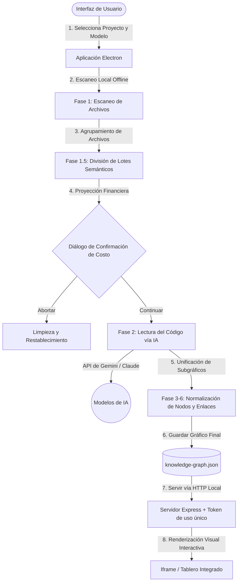

# Understand Anything Desktop

<p align="center">
  
</p>

<p align="center">
  <a href="https://github.com/Leosdc/understand-anything-desktop"></a>
  <a href="https://github.com/Leosdc/understand-anything-desktop/releases"></a>
  <a href="https://github.com/Leosdc/understand-anything-desktop/blob/main/LICENSE"></a>
  <a href="https://github.com/Lum1104"></a>
</p>

<p align="center">
  <b><a href="README.md">English</a></b> | 
  <b><a href="README.pt-BR.md">Português (Brasil)</a></b> | 
  <b><a href="README.es.md">Español</a></b> | 
  <b><a href="README.ja.md">日本語</a></b> | 
  <b><a href="README.zh.md">简体中文</a></b>
</p>

Transforme cualquier base de código en un gráfico de conocimiento interactivo para explorar visualmente, buscar y auditar. **¡Ahora con una hermosa aplicación de escritorio para Windows sin dependencias locales!**

Esta es la versión oficial de envoltura de escritorio y portátil del aclamado proyecto **Understand Anything**.

> [!IMPORTANT]
> **Créditos y Agradecimientos:** Esta aplicación de escritorio está construida sobre el excepcional pipeline de análisis de código creado por el desarrollador original, **Yuxiang Lin** ([@Lum1104](https://github.com/Lum1104) / [Repositorio de Understand-Anything](https://github.com/Lum1104/Understand-Anything)). Adaptamos los unificadores de gráficos de Python a TypeScript nativo y creamos un entorno seguro en Electron para hacer que esta poderosa herramienta sea accesible para todos sin dependencias de consola o interpretadores locales.

---

## 💡 ¿Por qué usar la versión Desktop (.exe) en lugar de la CLI original?

La versión portátil de escritorio fue diseñada para eliminar diversos obstáculos de usabilidad, configuración de entorno y control de costos presentes en el script de consola original:

* **Sin Configuración de Entorno (Portátil)**: El proyecto original requería instalar de forma global Node.js, Python 3, compiladores de C++ y varias librerías pesadas de Python (como pandas, networkx, etc.). El `.exe` compila todos los analizadores, scripts y enlazadores de nodos directamente en TypeScript nativo. Descarga, ejecuta y analiza de inmediato.
* **Proyección y Estimación de Costos previa**: Antes de consumir saldo en las API de Gemini o Claude, la aplicación realiza un análisis inicial del proyecto y muestra una vista previa del total de archivos, lotes de envío e inputs/outputs de tokens estimados para que decidas si deseas continuar o cancelar. **¡Puede editar las reglas de `.understandignore` directamente en este modal y recalcular los costos al instante! La aplicación soporta el catálogo completo de modelos Gemini (3.5, 2.5, 1.5, 2.0) y Claude (Sonnet 4.6, Opus 4.6, Sonnet 3.5, Haiku, Opus) con estimaciones precisas de tokens.**
* **Cancelación Activa en Tiempo Real**: Si la ejecución tarda mucho o el costo sube de manera imprevista, puedes cancelarla con un solo clic. El backend detiene las peticiones de IA activas y elimina los archivos temporales de forma inmediata. En la CLI, forzar el cierre con `Ctrl+C` generaba procesos zombies en el sistema y archivos corruptos.
* **Historial de Proyectos Recientes (Carga en 1s)**: Guarda una lista de tus últimos 5 repositorios analizados. Carga sus gráficos de forma instantánea a través de la interfaz en solo un segundo, sin gastar saldo de API ni volver a realizar un análisis completo o escribir rutas de carpetas.
* **Sincronización Dinámica de Idiomas**: Cambia el idioma de la aplicación en cualquier momento. La interfaz sincroniza de inmediato la configuración con el proyecto actual para que el dashboard visual refleje el nuevo idioma seleccionado de forma síncrona.
* **Servidor HTTP Local Protegido**: Inicializa un servidor backend ligero en Express protegido por tokens criptográficos únicos autogenerados en el inicio, evitando que otros equipos de tu red local accedan a tu base de código.

---

## ⚠️ Optimización de Costos de IA y Exclusiones

Debido a que **Understand Anything** lee la lógica real de tu base de código (Fase 2) para construir el gráfico de conocimiento semántico, analizar directorios pesados de terceros o archivos compilados puede consumir tokens de la API de IA en exceso.

Para evitar costos innecesarios:
1. **Editor Visual Integrado**: Puede crear o editar sus patrones de `.understandignore` directamente en el modal de estimación de costos antes de continuar con la IA. **Si el archivo de ignore no existe, el backend de la app lo genera automáticamente con reglas seguras en la primera ejecución.**
2. Alternativamente, cree o edite un archivo llamado `.understandignore` dentro de la carpeta `.understand-anything/` en la raíz de su proyecto.
3. Añade patrones glob (glob patterns) para los archivos y carpetas que desea ignorar (por ejemplo: `node_modules/`, `dist/`, `.git/`, logs, imágenes).
4. Para obtener una guía detallada de configuración y reglas avanzadas, consulta el [TUTORIAL.es.md](file:///c:/Users/PC/Documents/Bots/Understand-Anything/docs/TUTORIAL.es.md) completo.

---

### 📊 Flujo de Trabajo y Datos



---

## ✨ Características de Escritorio

- **📂 Selector de Proyectos Nativo**: Seleccione cualquier carpeta en su computadora utilizando diálogos nativos de Windows.
- **⚡ Proyectos Recientes Semánticos**: Cargue proyectos analizados previamente de forma instantánea. Si el gráfico ya existe, acceda al panel del visor en 1 segundo sin volver a ejecutar el análisis.
- **🛡️ Registros de Procesamiento en Tiempo Real**: Siga el progreso de las 7 fases del análisis (escaneo, procesamiento de lotes de IA, mapeo de capas y guías turísticos) en una consola interactiva.
- **🛑 Cancelación Real**: Detenga el análisis activo en cualquier momento. Los procesos en segundo plano y las solicitudes de IA se finalizan de inmediato para ahorrar tokens de API.
- **💰 Control de Costo Previo**: Estimación aproximada de tokens y costos en dólares ($) en la Fase 1.5, lo que le permite decidir si continuar o abortar la llamada de la IA.
- **🤖 Mascota Animada Flotante**: Asistente robótico visual integrado en las pantallas de configuración y progreso con reacciones al mouse.
- **💡 Ayuda Integrada**: Información sobre las fases, exclusiones en `.understandignore` y consejos de rendimiento directamente en la interfaz.
- **🔒 Servidor Web Local Seguro**: Servidor Express integrado protegido por tokens de acceso aleatorios de un solo uso generados en cada inicio.

---

## 🚀 Descarga Portátil (Inicio Rápido)

Para usuarios que solo desean utilizar la aplicación sin compilar localmente:

1. Vaya a la página de [Releases](https://github.com/Leosdc/understand-anything-desktop/releases) del repositorio en GitHub.
2. Descargue el archivo `.zip` de la versión más reciente (ej. `Understand-Anything-Desktop-win32-x64.zip`).
3. Extraiga el contenido en cualquier carpeta de su computadora.
4. Ejecute el archivo `Understand Anything.exe` para iniciar la aplicación.

---

## 🛠️ Instalación y Compilación

Para compilar y ejecutar la aplicación de escritorio localmente en su máquina, asegúrese de tener instalado Node.js:

1. Clone el repositorio:
   ```bash
   git clone https://github.com/Leosdc/understand-anything-desktop.git
   cd understand-anything-desktop
   ```
2. Instale las dependencias:
   ```bash
   npm install
   ```
3. Compile la aplicación y empaquete el ejecutable portátil (`.exe`):
   ```bash
   npm run build
   ```
   *(Este comando compila el frontend de React, el backend de Node.js, agrupa todas las dependencias del parser y genera la carpeta de la aplicación autónoma dentro de `dist-package/`).*
4. Una vez completado, vaya al directorio `dist-package/Understand Anything-win32-x64/` y ejecute `Understand Anything.exe`.

---

## 🔒 Privacidad y Seguridad de Datos

Understand Anything Desktop está diseñado con la privacidad local en primer lugar:

* **Cero Telemetría**: La aplicación no contiene rastreadores, telemetria o servicios de análisis en la nube de terceros.
* **Claves de API Locales**: Sus claves de API (Gemini y Claude) se almacenan localmente en su máquina en `%APPDATA%\Understand Anything\settings.json` y nunca se comparten ni se envían a servidores externos.
* **Procesamiento de Gráfico Local**: Los archivos de su base de código se analizan localmente. El gráfico semántico generado (`knowledge-graph.json`) se guarda estrictamente dentro del directorio de su propio proyecto bajo la carpeta oculta `.understand-anything/`.
* **Peticiones de IA Directas**: El único tráfico de red externo consiste en llamadas HTTPS directas y seguras enviadas a los endpoints oficiales de Google Gemini (`https://generativelanguage.googleapis.com`) y Anthropic Claude (`https://api.anthropic.com`) para realizar el análisis de código.

---

## 🤝 Contribuciones

Si encuentra útil esta aplicación de escritorio portátil, considere:
- ⭐️ Dejar una estrella en el repositorio en [GitHub](https://github.com/Leosdc/understand-anything-desktop)
- 💡 Contribuir con mejoras de código o reportar fallos en el rastreador del repositorio.

*¡Agradecimiento especial a **Yuxiang Lin (Lum1104)** por crear el pipeline original que hace posible este proyecto!*
