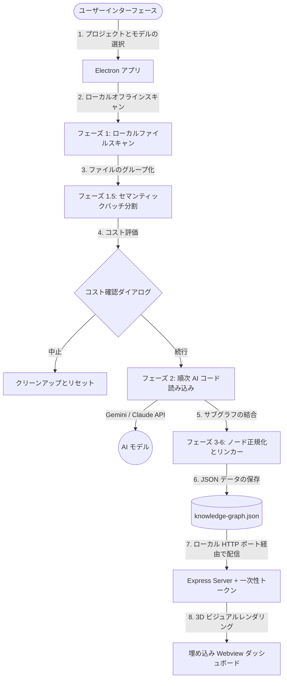

# Understand Anything Desktop

<p align="center">
  
</p>

<p align="center">
  <a href="https://github.com/Leosdc/understand-anything-desktop"></a>
  <a href="https://github.com/Leosdc/understand-anything-desktop/blob/main/LICENSE"></a>
  <a href="https://lum.is-a.dev/"></a>
</p>

任意のコードベースをインタラクティブな 3D 知識グラフに変換し、視覚的に探索、検索、および監査します。**Windows 用の、ローカル依存関係のない美しいデスクトップアプリケーションが利用可能になりました！**

これは、高く評価されている **Understand Anything** プロジェクトの公式デスクトップラッパーおよびポータブルバージョンです。

> [!IMPORTANT]
> **クレジットと謝辞：** このデスクトップアプリケーションは、元の開発者である **Luminis** が作成した優れたコードベース分析パイプラインに基づいて構築されています（[https://lum.is-a.dev/](https://lum.is-a.dev/) / [Understand-Anything リポジトリ](https://github.com/Egonex-AI/Understand-Anything)）。私たちは、Python のグラフマージャーをネイティブの TypeScript に移植し、安全な Electron デスクトップ環境を構築することで、ターミナルの依存関係なしにすべてのユーザーがこの強力なツールを利用できるようにしました。

---

## 💡 オリジナルの CLI ではなく、デスクトップアプリ (.exe) を使用する理由は？

デスクトップポータブルバージョンは、元のコマンドラインツール（CLI）における使いやすさ、環境構築、およびコスト管理の摩擦を解消するために設計されました。

* **環境構築が不要（ポータブル仕様）**：元のプロジェクトでは、Node.js、Python 3、C++ コンパイラ、および複数の Python ライブラリ（pandas、networkx など）のインストールが必要でした。ポータブル `.exe` 版は、すべての分析スクリプト、パーサー、ノード結合器をネイティブの TypeScript でパッケージ化しています。ダウンロードして即座に実行・分析が可能です。
* **トークン消費とコストの事前確認**：Gemini や Claude API トークンを消費する前に、デスクトップアプリがフォルダをスキャンし、分析対象ファイル、予測される AI リクエストバッチ、トークン数の見積もりを表示します。ユーザーはこれを確認した上で、続行または中止を決定できます。**また、このモーダル内で `.understandignore` の設定を直接編集し、その場でコストを再計算することも可能です！**
* **リアルタイムでの実行キャンセル**：分析に時間がかかりすぎている場合やコストが予想を超える場合、ワンクリックで処理を中断できます。バックエンドは直ちにアクティブな API コールを終了し、一時ファイルをクリーンアップします。CLI での `Ctrl+C` による強制終了と異なり、ゾンビプロセスの残存やファイルの破損を防ぎます。
* **履歴プロジェクト管理（1秒でロード）**：過去に分析した直近 5 つ of コードベースを履歴として記録します。すでにグラフが存在する場合は、UI から 1 秒でビジュアルダッシュボードを読み込めます。再度 AI への問い合わせでトークンを消費したり、ターミナルでパスを入力したりする必要はありません。
* **動的な多言語同期**：設定画面でアプリの言語を切り替えると、ダッシュボードの構成ファイルも同期して自動更新され、グラフレンダラーに設定言語が即座に反映されます。
* **安全なローカルサーバー環境**：バックエンドの Express サーバーはローカルでのみ実行され、起動時に生成されるワンタイム暗号トークンによって保護されているため、同一ネットワーク上の他端末からの不正アクセスを完全に遮断します。

## ⚠️ AI コスト最適化と除外ルール (.understandignore)

**Understand Anything** は、セマンティックな知識グラフを構築するために、コードベースの実際のロジックを読み取る（フェーズ 2）ため、大規模なサードパーティの依存関係フォルダやビルド成果物の分析は、大量 of AI API トークンを消費する可能性があります。

不要なコストを抑えるには：
1. **ビジュアルエディターの使用**：AIコールの確認用モーダル上で直接、`.understandignore` の除外パターンを記述・変更できます。
2. または、プロジェクトのフォルダ内に、`.understand-anything/` ディレクトリが存在することを確認するか、新規作成します。
3. そのフォルダの中に `.understandignore` という名前 of ファイルを作成または編集します。
4. 除外したいファイルやディレクトリの glob パターンを追加します（例: `node_modules/`, `dist/`, `.git/`, ログファイル、静的画像など）。
5. 詳細な設定や高度なルールについては、包括的な [TUTORIAL.ja.md](file:///c:/Users/PC/Documents/Bots/Understand-Anything/docs/TUTORIAL.ja.md) をご参照ください！

---

### 📊 アーキテクチャとデータフロー



---

## ✨ デスクトップ版の機能

- **📂 ネイティブプロジェクト選択機能**：Windows ネイティブのダイアログを使用して、コンピューター内の任意のプロジェクトフォルダを直接選択します。
- **⚡ セマンティックな履歴プロジェクト**：以前に分析したプロジェクトを瞬時に再ロードします。グラフがすでに存在する場合、コードを再分析することなく、1 秒でダッシュボードにアクセスできます。
- **🛡️ リアルタイム処理ログ**：分析の 7 つのフェーズ（スキャン、AI バッチ処理、レイヤーマッピング、ツアーガイド生成）の進行状況を、インタラクティブなターミナルコンソールで追跡します。
- **🛑 リアルタイムキャンセル**：実行中の分析をいつでも中止します。バックエンドプロセスとアクティブな AI リクエストは即座に終了し、API トークンの消費を節約します。
- **💰 トークン/コストの事前見積もり**：フェーズ 1.5 でトークン消費量と米ドル（$）のコストを概算し、AI コールの続行または中止をユーザーが選択できるようにします。
- **🤖 アニメーション浮遊マスコット**：設定および進行画面にロボットアシスタントが組み込まれており、マウスホバーに対してズーム反応を示します。
- **💡 統合ヘルプシステム**：フェーズの説明、`.understandignore` による除外設定、大規模プロジェクト向けのパフォーマンス向上のヒントをインターフェース上で直接確認できます。
- **🔒 安全なローカル Web サーバー**：起動ごとに生成される使い捨てのランダムなアクセスキーによって保護された、組み込みの Express サーバー。

---

## 🛠️ インストールと使用方法

ビルド済みのポータブルフォルダを直接ダウンロードするか、ご自身でプロジェクトをビルドできます。Python 環境や C++ コンパイラのインストールは不要です！

### 方法 1：ビルド済みのポータブルバージョン (.exe) の実行
1. ディレクトリ [dist-package/Understand Anything-win32-x64](https://github.com/Leosdc/understand-anything-desktop/tree/main/dist-package/Understand%20Anything-win32-x64) にアクセスします。
2. `Understand Anything.exe` をダブルクリックします。
3. **Google Gemini** または **Anthropic Claude** の API キーを入力します（ローカルに安全に保存されます）。
4. プロジェクトのフォルダを選択し、**Analisar Repositório**（分析実行）をクリックします。

### 方法 2：ソースコードからのビルド
ローカルでデスクトップアプリをコンパイルしたい場合は、Node.js がインストールされていることを確認してください：

1. リポジトリをクローンします：
   ```bash
   git clone https://github.com/Leosdc/understand-anything-desktop.git
   cd understand-anything-desktop
   ```
2. 依存関係をインストールします：
   ```bash
   npm install
   ```
3. アプリケーションをビルドし、ポータブル `.exe` をパッケージングします：
   ```bash
   npm run build
   ```
   *(この単一のコマンドで、React フロントエンドの生成、esbuild を使用した Node.js バックエンドのコンパイル、必要なアセットのコピー、および `dist-package/` フォルダ内へのポータブル実行ファイルの作成がすべて行われます)。*

---

## 🤝 貢献とサポート

このポータブルデスクトップアプリケーションが役に立った場合は、以下をご検討ください：
- ⭐️ [GitHub](https://github.com/Leosdc/understand-anything-desktop) でリポジトリにスターを付ける
- 💡 コードの改善やバグ報告をリポジトリの Issue トラッカーで行う

*このプロジェクトを可能にするオリジナルのパイプラインを作成してくれた **Luminis** に深く感謝します！*
