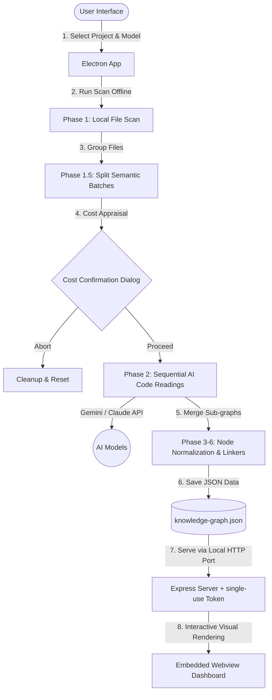

# Understand Anything Desktop

<p align="center">
  
</p>

<p align="center">
  <a href="https://github.com/Leosdc/understand-anything-desktop"></a>
  <a href="https://github.com/Leosdc/understand-anything-desktop/releases"></a>
  <a href="https://github.com/Leosdc/understand-anything-desktop/blob/main/LICENSE"></a>
  <a href="https://github.com/Lum1104"></a>
</p>

<p align="center">
  <b><a href="README.md">English</a></b> | 
  <b><a href="README.pt-BR.md">Português (Brasil)</a></b> | 
  <b><a href="README.es.md">Español</a></b> | 
  <b><a href="README.ja.md">日本語</a></b> | 
  <b><a href="README.zh.md">简体中文</a></b>
</p>

Turn any codebase into an interactive knowledge graph you can explore visually, search, and audit. **Now with a beautiful, zero-dependency Desktop App for Windows!**

This is the official desktop wrapper and portable version of the acclaimed **Understand Anything** project. 

> [!IMPORTANT]
> **Credits & Acknowledgements:** This desktop application is built on top of the exceptional codebase analysis pipeline created by the original developer, **Yuxiang Lin** ([@Lum1104](https://github.com/Lum1104) / [Understand-Anything Repo](https://github.com/Lum1104/Understand-Anything)). We ported the Python graph mergers to native TypeScript and built a secure Electron desktop environment to make this powerful tool accessible to everyone without terminal dependencies.

---

## 💡 Why use the Desktop App (.exe) instead of the original CLI?

The desktop portable version was designed to solve several usability, environment setup, and cost control friction points of the original CLI:

* **Zero Environment Setup (Portable)**: The original project required Node.js, Python 3, C++ compilers, and several Python libraries (pandas, networkx, etc.). The `.exe` bundles all analysis scripts, parsers, and node linkers in native TypeScript. Download, run, and analyze immediately.
* **Cost Appraisal & Token Estimates**: Before spending your money on Gemini or Claude API tokens, the Desktop App scans your folder and displays a summary of the files, estimated AI request batches, and tokens, allowing you to proceed or cancel. **You can edit the `.understandignore` rules directly inside this dialog and recalculate the costs on the fly! The app supports the complete Gemini (3.5, 2.5, 1.5, 2.0) and Claude (Sonnet 4.6, Opus 4.6, Sonnet 3.5, Haiku, Opus) model catalog with accurate live token rates.**
* **Real-time Cancellation**: If an analysis is taking too long or costing too much, you can cancel it with one click. The backend halts active API calls and cleans up temporary files immediately. In the CLI, killing with `Ctrl+C` could leave rogue processes and corrupted files.
* **Recent Projects History (1-Second Loading)**: Keep a list of your last 5 analyzed codebases. Load their visual graph instantly from the UI without performing a new analysis or writing terminal command paths.
* **Dynamic Multi-Language Sync**: Switch the interface language dynamically. The app automatically updates your active project configuration so that the rendering dashboard matches your preferred language immediately.
* **Secure Local Server**: Runs a secure, lightweight Express backend locally, protected by a single-use authorization token generated on startup to prevent local network breaches.

---

## ⚠️ AI Cost Optimization & Exclusions

Because **Understand Anything** reads the actual logic of your codebase (Phase 2) to build its semantic knowledge graph, analyzing heavy third-party directories or built assets can consume excessive AI API tokens. 

To prevent unnecessary costs:
1. **Live Ignore Editor**: You can create or edit your `.understandignore` patterns directly inside the cost estimation modal before proceeding. **If the file does not exist in your repository, the app backend automatically generates it with safe default rules on the first run.**
2. Alternatively, inside your project folder, locate or create the `.understand-anything/` directory.
3. Create or edit a file named `.understandignore` inside that folder.
4. Add glob patterns for files and directories you want to ignore (e.g. `node_modules/`, `dist/`, `.git/`, logs, images).
5. For a complete detailed setup and advanced rules, check out the comprehensive [TUTORIAL.md](file:///c:/Users/PC/Documents/Bots/Understand-Anything/docs/TUTORIAL.md)!

---

### 📊 Architecture & Data Flow



---

## ✨ Desktop Features

- **📂 Native Project Selector**: Select any folder in your computer directly using native Windows dialogs.
- **⚡ Semantic Recent Projects**: Instantly reload previously analyzed projects. If the graph exists, access the dashboard in 1 second without re-running the analysis.
- **🛡️ Real-time Processing Logs**: Follow the 7-phase analysis (Scanning, IA Batch processing, Architecture Layer Mapping, Tour guides creation) in a terminal log viewer.
- **🛑 Real Cancellation**: Abort ongoing analysis at any time. Backend processes and active AI requests are stopped immediately to save API tokens.
- **🤖 Animated Floating Mascot**: Interactive visual assistant that floats in the setup and progress screens.
- **💡 Built-in Help System**: Access phase descriptions, speed guidelines, and tips for massive projects right inside the UI.
- **🔒 Secure Local Web Server**: Express server runs locally protected by a single-use token generated on startup.

---

## 🛠️ Installation & Usage

You can download the compiled portable folder directly or build it yourself. No Python or C++ compilers are required!

### Method 1: Running the Pre-compiled Portable Version (.exe)
1. Go to the [dist-package/Understand Anything-win32-x64](https://github.com/Leosdc/understand-anything-desktop/tree/main/dist-package/Understand%20Anything-win32-x64) directory.
2. Double-click `Understand Anything.exe`.
3. Paste your **Google Gemini** or **Anthropic Claude** API key (stored securely on your machine).
4. Select a project folder and click **Analisar Repositório**.

### Method 2: Building from Source
If you want to compile the desktop app locally, ensure you have Node.js installed:

1. Clone the repository:
   ```bash
   git clone https://github.com/Leosdc/understand-anything-desktop.git
   cd understand-anything-desktop
   ```
2. Install dependencies:
   ```bash
   npm install
   ```
3. Build the application and package the portable `.exe`:
   ```bash
   npm run build
   ```
   *(This single command compiles the React frontend, Electron backend, copies all assets, and packages the desktop app in the `dist-package/` folder).*

---

## 🤝 Contributions

If you find this desktop wrapper useful, please consider:
- ⭐️ Star the repository on [GitHub](https://github.com/Leosdc/understand-anything-desktop)
- 💡 Contributing code improvements or filing issues in the tracker.

*Thank you to **Yuxiang Lin (Lum1104)** for creating the original pipeline that makes this project possible!*
