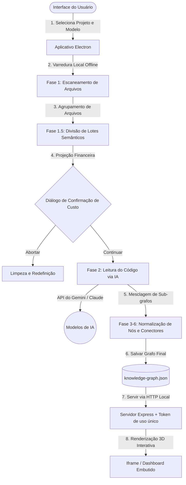

# Understand Anything Desktop

<p align="center">
  
</p>

[](https://github.com/Leosdc/understand-anything-desktop)
[](https://github.com/Leosdc/understand-anything-desktop/blob/main/LICENSE)
[](https://lum.is-a.dev/)

Transforme qualquer base de código em um grafo de conhecimento 3D interativo para explorar visualmente, pesquisar e auditar. **Agora com um aplicativo desktop para Windows bonito e sem dependências locais!**

Este é o empacotamento oficial de desktop e versão portátil do aclamado projeto **Understand Anything**.

> [!IMPORTANT]
> **Créditos & Agradecimentos:** Este aplicativo desktop é construído sobre o excepcional pipeline de análise de código criado pelo desenvolvedor original, **Luminis** ([https://lum.is-a.dev/](https://lum.is-a.dev/) / [Repositório Understand-Anything](https://github.com/Egonex-AI/Understand-Anything)). Nós portamos os mescladores de grafo escritos em Python para TypeScript nativo e criamos um ambiente seguro em Electron para tornar esta ferramenta incrível acessível a todos sem dependências de terminal ou interpretadores locais.

### 📊 Fluxo de Trabalho & Dados



---

## ✨ Recursos do Desktop

- **📂 Seletor de Projetos Nativo**: Selecione qualquer pasta no seu computador usando caixas de diálogo nativas do Windows.
- **⚡ Projetos Recentes Semânticos**: Recarregue projetos analisados anteriormente de forma instantânea. Se o grafo já existir, acesse o painel visualizador em 1 segundo sem reanalisar o código.
- **🛡️ Logs de Processamento em Tempo Real**: Acompanhe o progresso das 7 fases da análise (varredura, processamento de lotes IA, mapeamento de camadas e guias turísticos) em um console interativo.
- **🛑 Cancelamento Real**: Interrompa a análise ativa a qualquer momento. Os subprocessos e requisições de IA são finalizados no backend imediatamente para poupar tokens de API.
- **💰 Controle Prévio de Custos**: Avaliação estimada de tokens e custos em dólares ($) na Fase 1.5, permitindo que o usuário decida se deseja continuar ou abortar a chamada de IA.
- **🤖 Mascote Animado Flutuante**: Assistente robótico visual integrado às telas de Setup e Progresso com reações ao mouse.
- **💡 Ajuda Integrada**: Informações sobre as fases, exclusões no `.understandignore` e dicas de performance na interface.
- **🔒 Servidor Web Local Seguro**: Servidor Express embutido e protegido por tokens de acesso aleatórios de uso único gerados a cada boot.

---

## 🛠️ Instalação & Uso

Você pode baixar a pasta portátil pré-compilada diretamente ou compilar o projeto você mesmo. Nenhuma dependência de Python ou compiladores de C++ é exigida!

### Método 1: Executando a Versão Portátil Pré-compilada (.exe)
1. Acesse o diretório [dist-package/Understand Anything-win32-x64](https://github.com/Leosdc/understand-anything-desktop/tree/main/dist-package/Understand%20Anything-win32-x64).
2. Dê um duplo clique em `Understand Anything.exe`.
3. Insira sua chave de API do **Google Gemini** ou **Anthropic Claude** (salva localmente de forma segura).
4. Escolha a pasta do projeto e clique em **Analisar Repositório**.

### Método 2: Compilando a partir do Código-Fonte
Se deseja compilar o aplicativo desktop localmente, certifique-se de ter o Node.js instalado:

1. Clone o repositório:
   ```bash
   git clone https://github.com/Leosdc/understand-anything-desktop.git
   cd understand-anything-desktop
   ```
2. Instale as dependências:
   ```bash
   npm install
   ```
3. Compile o front-end, backend e empacote o aplicativo portátil:
   ```bash
   npm run build
   ```
   *(Este comando único gera o front-end React, compila o backend em Node.js usando esbuild, move as skills e arquivos estáticos e gera o executável em `dist-package/`).*

---

## 🤝 Contribuições

Se você achar este aplicativo desktop portátil útil, por favor considere:
- ⭐️ Deixar uma estrela no repositório no [GitHub](https://github.com/Leosdc/understand-anything-desktop)
- 💡 Contribuir com melhorias de código ou reportar bugs no tracker do repositório.

*Agradecimento especial ao **Luminis** por criar o pipeline original que torna este projeto possível!*
