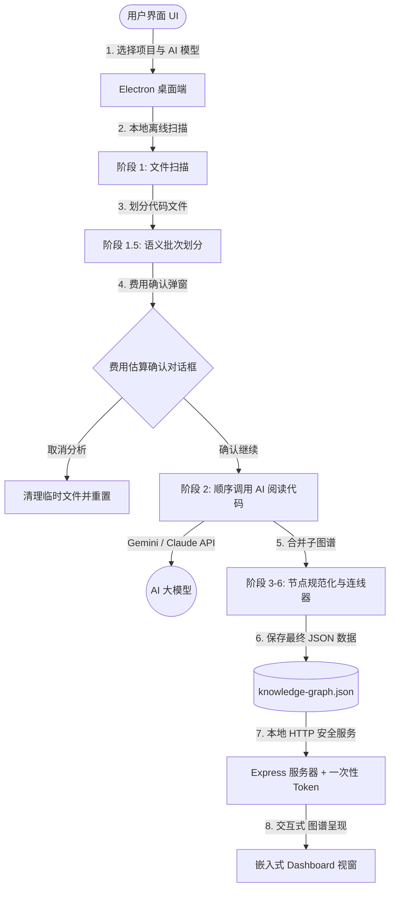

# Understand Anything Desktop

<p align="center">
  
</p>

[](https://github.com/Leosdc/understand-anything-desktop)
[](https://github.com/Leosdc/understand-anything-desktop/blob/main/LICENSE)
[](https://lum.is-a.dev/)

将任何代码库转换为交互式的 知识图谱，以进行可视化探索、搜索和审计。**现在配备了美观、零本地依赖的 Windows 桌面端应用程序！**

这是备受瞩目的 **Understand Anything** 项目的官方桌面包装器及便携版本。

> [!IMPORTANT]
> **致谢与鸣谢：** 本桌面应用程序基于原作者 **Luminis** 开发的卓越代码库分析流水线构建（[https://lum.is-a.dev/](https://lum.is-a.dev/) / [Understand-Anything 仓库](https://github.com/Egonex-AI/Understand-Anything)）。我们将 Python 编写 institutional 图谱合并程序移植为原生 TypeScript，并构建了安全的 Electron 桌面环境，使用户无需安装复杂的终端依赖或本地语言环境即可使用此强大工具。

### 📊 架构与数据流



---

## ✨ 桌面端功能特性

- **📂 原生项目选择器**：使用原生 Windows 对话框直接选择计算机中的任何项目文件夹。
- **⚡ 语义化历史项目**：瞬间重新加载先前分析过的项目。如果图谱已存在，可在 1 秒内直接打开可视化面板，无需重新分析代码。
- **🛡️ 实时处理日志**：在交互式终端视图中跟踪分析的 7 个阶段（扫描、AI 批处理、架构层级映射和向导路线生成）的进度。
- **🛑 实时取消**：随时中止当前进行的分析。后端进程和 active AI 请求将立即终止，以节省 API Token 费用。
- **💰 提前费用管控**：在阶段 1.5 中估算 Token 消耗和美元（$）费用，允许用户决定是继续还是中止 AI 接口调用。
- **🤖 动画悬浮助手**：在配置和进度屏幕中嵌入了交互式机器人视觉助理，可对鼠标悬停做出缩放反应。
- **💡 内置帮助系统**：直接在界面中查看阶段说明、`.understandignore` 排除项配置以及针对超大型项目的性能优化建议。
- **🔒 安全本地 Web 服务器**：内置 Express 服务器，由每次启动时随机生成的单次使用访问令牌保护。

---

## 🛠️ 安装与使用

您可以直接下载预编译好的便携式文件夹，或自行构建项目。无需安装 Python 环境或 C++ 编译器！

### 方法一：运行预编译便携版 (.exe)
1. 访问目录 [dist-package/Understand Anything-win32-x64](https://github.com/Leosdc/understand-anything-desktop/tree/main/dist-package/Understand%20Anything-win32-x64)。
2. 双击运行 `Understand Anything.exe`。
3. 输入您的 **Google Gemini** 或 **Anthropic Claude** API 密钥（安全地保存在本地）。
4. 选择您的项目文件夹并点击 **Analisar Repositório**（分析代码库）。

### 方法二：从源码构建
如果您希望在本地编译桌面端应用程序，请确保已安装 Node.js：

1. 克隆仓库：
   ```bash
   git clone https://github.com/Leosdc/understand-anything-desktop.git
   cd understand-anything-desktop
   ```
2. 安装依赖项：
   ```bash
   npm install
   ```
3. 构建应用程序并打包便携式 `.exe`：
   ```bash
   npm run build
   ```
   *(该单一命令将生成 React 前端，使用 esbuild 编译 Node.js 后端，复制所有必要资源，并在 `dist-package/` 文件夹中生成便携式可执行文件)。*

---

## 🤝 贡献与支持

如果您觉得这个便携式桌面端应用对您有所帮助，请考虑：
- ⭐️ 在 [GitHub](https://github.com/Leosdc/understand-anything-desktop) 上为本仓库点亮星星。
- 💡 贡献代码改进，或在仓库的 Issue 跟踪器中反馈 bug。

*特别鸣谢 **Luminis** 创造了使该项目成为可能的核心分析分析流水线！*
